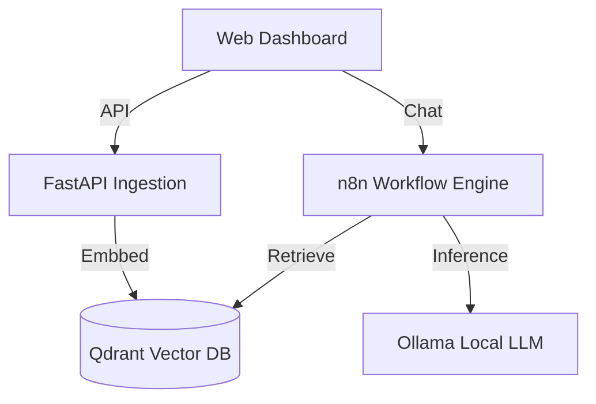

# 🏯 Sovereign RAG Stack
> **The Enterprise-Grade, Self-Hosted AI Platform.**

## Overview
This is **not** a simple chatbot script. 
This is a **full-topology microservices architecture** designed to run an entire AI department on-premise (Air-Gapped).

It orchestrates **Vector Search**, **LLM Inference**, **Workflow Automation**, and **Document Ingestion** into a single deployable unit.

## 🏗️ Architecture


## 📦 The Stack
| Service | Tech | Role |
| :--- | :--- | :--- |
| **Brain** | `Qdrant` | High-performance Vector Store (Rust-based). |
| **Logic** | `n8n` | Low-code orchestration for complex agentic flows. |
| **Engine** | `Ollama` | Managers local Llama 3 / Mistral / Deepseek models. |
| **Ingest** | `FastAPI (Python)` | Custom document parser (PDF/OCR) and chunking pipeline. |
| **UI** | `Next.js` | (Code available in `/frontend-dashboard`) |

## 🚀 Deployment
One command to rule them all.

```bash
docker-compose up -d
```

## 🛡️ Why "Sovereign"?
*   **Zero Data Leakage**: Your documents never leave this cluster.
*   **Zero Vendor Lock-in**: Switch from Llama 3 to Deepseek R1 in 1 line of config.
*   **Auditable**: Every interaction is logged in your local Postgres.

---
*Maintained by Taha E.*
